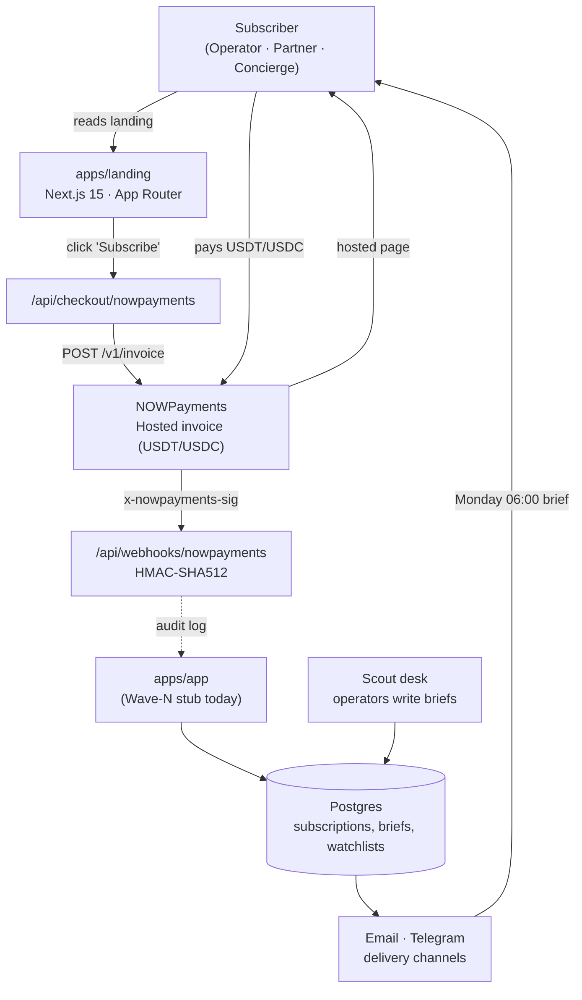

# 02 · Architecture — Personal Industry Scout

## System diagram

## Components

| Component | Wave-2 status | Stack |
| --- | --- | --- |
| `apps/landing` | shipped | Next.js 15 · App Router · Tailwind v3.4 · Tailwind-merge · Source Serif 4 + Inter + JetBrains Mono via `next/font` |
| `apps/landing/api/checkout/nowpayments` | shipped | Node runtime · `POST /v1/invoice` to NOWPayments · 400/502/503 error map |
| `apps/landing/api/webhooks/nowpayments` | shipped | Node runtime · HMAC-SHA512 verifier on alphabetically-sorted JSON · 401 on signature mismatch |
| `apps/app` | stub (`.gitkeep` + `README.md`) | Plan: fork Open-SaaS (Wasp), Postgres for subscriptions/briefs/watchlists |
| Scout desk ops | manual today | Editorial team writes briefs in private Notion DB; Telegram bot delivers Concierge alerts |
| Reverse proxy | shared | Traefik (host-network) on storage-contabo, LE resolver `letsencrypt` |

## Data flows

1. **Acquisition** — visitor lands on `https://personal-industry-scout.prin7r.com`, scrolls to Pricing, clicks one of the three CTAs.
2. **Invoice creation** — `POST /api/checkout/nowpayments {plan}` server-side calls `https://api.nowpayments.io/v1/invoice` with `price_amount`, `order_id` (`scout_<plan>_<ts>_<rand>`), `ipn_callback_url`, `success_url`, `cancel_url`. Returns `{invoice_url, invoice_id}`.
3. **Hosted checkout** — client redirects to NOWPayments hosted invoice page. Subscriber pays in USDT or USDC.
4. **Notification** — NOWPayments POSTs the result to `/api/webhooks/nowpayments` with header `x-nowpayments-sig` (HMAC-SHA512 of alphabetically sorted JSON). The route verifies, returns 401 on mismatch, otherwise logs `[SCOUT_NOWPAYMENTS_IPN] verified=true order_id=… status=… paid=…` to journalctl.
5. **Fulfilment** — desk operator activates the subscriber in the Scout DB. The first Monday brief is queued for delivery at 06:00 in the subscriber's tz.

## Deploy topology

- **Host**: `storage-contabo` (`161.97.99.120`). DNS: wildcard `*.prin7r.com` already covers `personal-industry-scout.prin7r.com`.
- **Reverse proxy**: dokploy-traefik in host-network mode discovers the container via Docker provider on `/var/run/docker.sock` + the `traefik.http.routers.personal-industry-scout.*` labels in `docker-compose.yml`.
- **Container**: `personal-industry-scout-landing` — Next.js 15 standalone, `EXPOSE 3000`, `expose: "3000"` (no host port mapping). Reads runtime env from `/opt/prin7r-deploys/personal-industry-scout/.env` via `env_file: .env`.
- **TLS**: Let's Encrypt HTTP-01 via the `letsencrypt` resolver on dokploy-traefik (email `kee22r@gmail.com`).
- **Logs**: `docker compose logs -f landing` and journalctl on the host carry the IPN audit trail.

## Failure modes & graceful degradation

- **`NOWPAYMENTS_API_KEY` unset**: `/api/checkout/nowpayments` returns `503 missing_env`; the client renders an inline `mailto:` fallback to the desk.
- **NOWPayments upstream 5xx**: returns `502 upstream_error`; client renders the same fallback. The desk hand-wires the invoice within 12h.
- **IPN signature mismatch**: returns `401 signature_invalid`. We never trust an unverified payload, even if it arrives from a NOWPayments-shaped IP.
- **Container restart**: stateless. Subscriptions and brief content live outside the landing.
